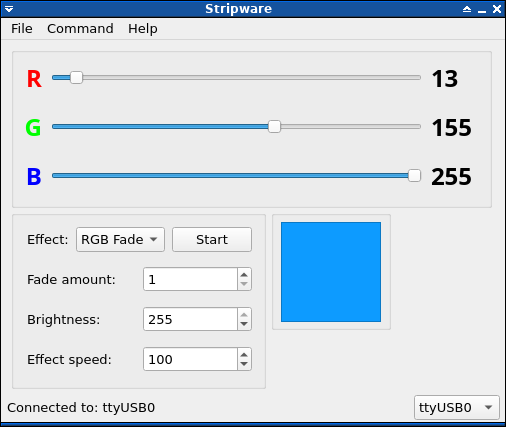
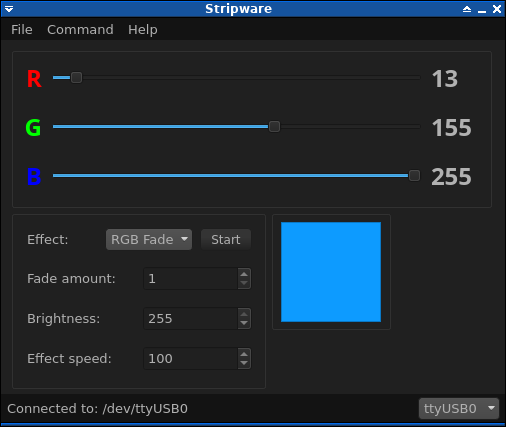

# Stripware
A simple RGB LED strip controller software with a gui built in Qt.

This project was inspired by vannevar-morgan's similiar project, [check it out here!](https://github.com/vannevar-morgan/Qt-RGB-LED)

 

## How to use
* Currently it's only working on Linux. I might port it to Windows later if I have the time for it.
* Pre-built binaries aren't available right now, but you can built it for yourself.
* If you're not familiar with the command line don't be scared, Its really easy just follow my instructions below.

### Dependencies
* For building you'll need **qmake**, **qt5** and a C++ compiler like **g++**
* You'll have to get these packages by yourself if you don't have them yet, I can't list all the distros here, but usually they are called the same as above.
* If you want to use git to clone this repository before building you'll need... git!

## How to build

### Windows
* Sorry, the Windows version is not ready yet. Check back later.

### Linux
Make sure you have your dependencies ready!
1. Open your terminal emulator
2. Clone the repository using: `git clone https://github.com/gabor-smith/stripware`
3. Change into the cloned directory: `cd stripware/Stripware-qt/`
4. Run qmake: `qmake Stripware.pro`
5. Run make: `make`

Thats it! You can now run the program using: `./Stripware`

## Usage
The program accepts these commands from the terminal:
- `--port` - serial port to be used for communication with the RGB controller ex. `--port=/dev/ttyS0`, default is /dev/ttyUSB0
- `--min` - starts the program in minimized mode

### Dark theme
As with any Qt application this one accepts the `-stylesheet` command in the terminal to use a custom qt stylesheet.
I included a customized version of [this.](https://tech-artists.org/t/release-qt-dark-orange-stylesheet/2287)

If you want to use the included dark stylesheet, type `-stylesheet=stylesheet.qss` when launching the program.

## Postscript
If you find any issues with this program please report them [here.](https://github.com/gabor-smith/stripware/issues/new)
Thank you.

## License
Stripware is licensed under GPLv3+, see LICENSE.md for more.
